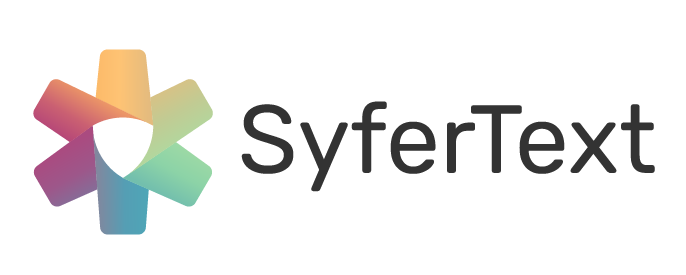

[](https://opensource.org/licenses/Apache-2.0)
[](https://www.python.org/downloads/release/python-360/)
<!-- ALL-CONTRIBUTORS-BADGE:START - Do not remove or modify this section -->

[](#contributors-)

<!-- ALL-CONTRIBUTORS-BADGE:END -->

## SyferText

SyferText is a library for privacy preserving Natural Language Processing in Python. It leverages PySyft to perform Federated Learning and Encrypted Computations (
[Multi-Party Computation (MPC)](https://en.wikipedia.org/wiki/Secure_multi-party_computation) on text data. The two main usage scenarios of SyferText are:

- :fire: **Secure plaintext pre-processing:** Enables pre-processing of  text located on a remote machine without breaking data privacy.
- :rocket: **Secure pipeline deploy:** Starting from version 0.1.0, SyferText will be able to bundle a complete pipeline composed of pre-processing components and trained PySyft models and to securely deploy it to PyGrid.

To get a more detailed introduction about SyferText, watch :movie_camera: [OpenMined AMA with Alan Aboudib](https://youtu.be/gtwOPxxJ5F4)  available on YouTube.


## Installation

You can install SyferText by directly cloning this repo:

```
$ git clone https://github.com/OpenMined/SyferText.git
$ cd SyferText
$ python setup.py install
```

That's it, you are good to go!

## Getting Started

SyferText can be used to work with datasets residing on a local machine (or a local worker as we call it in [PySyft](https://github.com/OpenMined/PySyft)), as well as with private datasets on remote workers. Here is a list of tutorials that you can follow to get more familiar with SyferText:


More tutorials are coming soon. Stay tuned!

## Our Team

SyferText is created and maintained by the NLP team at OpenMined and by volunteer contributors from all around the world. Here are the current members of the core NLP team. The team is growing!

<br>
<table>
  <tr>
    <td align="center">
      <a href="https://twitter.com/alan_aboudib">
        
        <br /><sub><b>Alan Aboudib</b></sub></a><br />
        <sub>Team Lead / Author</sub>
      </a>
    </td>
    <td align="center">
      <a href="https://github.com/Nilanshrajput">
        
        <br /><sub><b>Nilansh Rajput</b></sub></a><br />
        <sub>OM NLP team / Core Dev</sub>
      </a>
    </td>
    <td align="center">
      <a href="https://github.com/bicycleman15">
        
        <br /><sub><b>Jatin Prakash</b></sub></a><br />
        <sub>OM NLP team / Core Dev</sub>
      </a>
    </td>
    <td align="center">
      <a href="https://github.com/ramesht007">
        
        <br /><sub><b>Ramesht Shukla</b></sub></a><br />
        <sub>OM NLP Team / Core Dev</sub>
      </a>
    </td>
  </tr>
  <tr>
    <td align="center">
      <a href="https://github.com/hershd23">
        
        <br /><sub><b>Hersh Dhillon</b></sub></a><br />
        <sub>OM NLP team / Core Dev</sub>
      </a>
    </td>
  </tr>
</table>
<br>

[](https://sourcerer.io/fame/Nilanshrajput/Nilanshrajput/SyferText/links/0)[](https://sourcerer.io/fame/Nilanshrajput/Nilanshrajput/SyferText/links/1)[](https://sourcerer.io/fame/Nilanshrajput/Nilanshrajput/SyferText/links/2)[](https://sourcerer.io/fame/Nilanshrajput/Nilanshrajput/SyferText/links/3)[](https://sourcerer.io/fame/Nilanshrajput/Nilanshrajput/SyferText/links/4)[](https://sourcerer.io/fame/Nilanshrajput/Nilanshrajput/SyferText/links/5)[](https://sourcerer.io/fame/Nilanshrajput/Nilanshrajput/SyferText/links/6)[](https://sourcerer.io/fame/Nilanshrajput/Nilanshrajput/SyferText/links/7)

## Events

- **(October 26th, 2019)** [DevFest2019, Reading, UK](https://www.meetup.com/GDG-Reading-Thames-Valley/events/262918960/).

Demo on remote blind tokenization with SyferText.


- **(March 19th, 2020)** [GDG Meetup, Reading, UK](https://www.meetup.com/GDG-Reading-Thames-Valley/events/268137223/). *(Cancelled due to COVID-19)*

Demo on sentiment analysis with SyferText on multiple private datasets.


- **(May 13th, 2020)**: [OpenMined AMA](https://www.youtube.com/channel/UCzoUqDE_OzYo6lGXtsEbOxQ). *(Cancelled due to COVID-19)*


- **(June 17th, 2020)**: [OpenMined AMA](https://www.youtube.com/watch?v=gtwOPxxJ5F4&t=2907s).

SyferText vision and encrypted sentiment analyzer demo.


- **(June 18th, 2020)**: [The Federated Learning Conference](https://federatedlearningconference.com/index.php/schedule-2/schedule-3).

Introduction to SyferText.

- **(July 8th, 2020)**: [OpenMined Paris Meetup](https://www.youtube.com/watch?v=KrjyfZDERsI&t=5040s).

SyferText vision and encrypted sentiment analyzer demo.


- **(July 29th, 2020)**: [MLH Fellowship Talk](https://www.youtube.com/watch?v=F36Mak1hdlo).

About SyferText and my Open Source Contribution Experience with OpenMined


## News

To get news about feature and tutorial relseases:

Alan Aboudib: [@twitter](https://twitter.com/alan_aboudib)

and join [#lib_syfertext](https://openmined.slack.com/archives/CUWDZMED9) channel on slack.


## Support
To get support in using this library, please join the **#lib_syfertext** Slack channel. If you’d like to follow along with any code changes to the library, please join the **#code_syfertext** Slack channel. [Click here to join our Slack community!](https://slack.openmined.org)


## Contact Us

You can reach out to us by contacting Alan on one of the following channels:

 [LinkedIn](https://www.linkedin.com/in/ala-aboudib/) | [Slack](https://app.slack.com/client/T6963A864/DDKH3SXKL/user_profile/UDKH3SH8S) | [Twitter](https://twitter.com/alan_aboudib)


## License
[Apache License 2.0](https://choosealicense.com/licenses/apache-2.0/)
