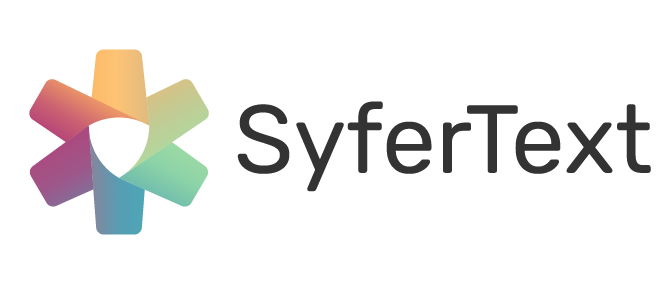

[](https://opensource.org/licenses/Apache-2.0)
[](https://www.python.org/downloads/release/python-360/)


## Installation

You can clone this repo and install SyferText by running:

```
$ git clone https://github.com/OpenMined/SyferText.git
$ cd SyferText
$ python setup.py install
```

## Getting Started

SyferText can be used to work with strings residing on a local machine (or a local worker as we call it in [PySyft](https://github.com/OpenMined/PySyft)), as well as with strings on remote workers.

To learn how to use SyferText for local string tokenization, you can refer to [this tutorial](https://github.com/OpenMined/SyferText/blob/master/tutorials/Part%200%20-%20(Getting%20Started)%20Local%20Tokenization.ipynb).

For remote string tokenization, check out [this tutorial](https://bit.ly/37VEJ28).

More tutorials are coming soon. Stay tuned!

## Our Team

SyferText is created and maintained by the NLP team at OpenMined and by voluneer contributors from all around the world. Here are the current members of the core NLP team. The team is growing!

<br>
<table>
  <tr>
    <td align="center">
      <a href="https://twitter.com/alan_aboudib">
        
        <br /><sub><b>Alan Aboudib</b></sub></a><br />
        <sub>Team Lead / Author</sub>
      </a>
    </td>
    <td align="center">
      <a href="https://github.com/dzlab">
        
        <br /><sub><b>Bachir Chihani</b></sub></a><br />
        <sub>OM NLP Team / Contributor</sub>
      </a>
    </td>
    <td align="center">
      <a href="https://github.com/MarcioPorto">
        
        <br /><sub><b>Márcio Porto</b></sub></a><br />
        <sub>OM NLP team / Contributor</sub>
      </a>
    </td>
    <td align="center">
      <a href="https://github.com/Nilanshrajput">
        
        <br /><sub><b>Nilansh Rajput</b></sub></a><br />
        <sub>OM NLP team / Contributor</sub>
      </a>
    </td>
  </tr>
  <tr>
    <td align="center">
      <a href="https://github.com/sachin-101">
        
        <br /><sub><b>Sachin Kumar</b></sub></a><br />
        <sub>OM NLP team / Contributor</sub>
      </a>
    </td>
    <td align="center">
      <a href="https://github.com/bicycleman15">
        
        <br /><sub><b>Jatin Prakash</b></sub></a><br />
        <sub>OM NLP team / Contributor</sub>
      </a>
    </td>
  </tr>
  
  
</table>
<br>

## SyferText News

To get news about feature and tutorial relseases:

Alan Aboudib: [@twitter](https://twitter.com/alan_aboudib)

 and join [#team_nlp channel on slack](https://openmined.slack.com/archives/CUWDZMED9)


## Call for Partners

We, at the NLP team, are eager to learn about new real-world use-cases around which new features in SyferText could be built. 

If you think that SyferText, in its current state or by adding more features, could be useful to your research or company, please contact us as indicated below in the **Contact Us** section, and let us discuss how we can help.


## Contact Us

You can reach out to us by contacting Alan on one of the following channels:

 [LinkedIn](https://www.linkedin.com/in/ala-aboudib/) | [Slack](https://app.slack.com/client/T6963A864/DDKH3SXKL/user_profile/UDKH3SH8S) | [Twitter](https://twitter.com/alan_aboudib)
 
-------

For more updates on our activities at OpenMined and for getting exciting news and announcements about our different projects, you can join our rapidly growing community of 7000+ on [Slack](https://slack.openmined.org/). You can follow our [official twitter page](https://twitter.com/openminedorg), as well as OpenMined [founder's twitter page](https://twitter.com/iamtrask).
